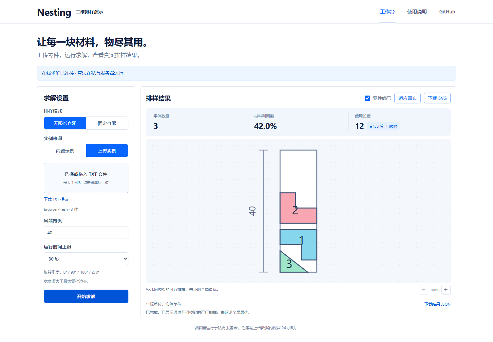

# Nesting · 二维排样演示

独立的公开前端。求解器源代码、程序、数据集、数据库和凭证均不在本仓库。

页面：https://iliujin.github.io/nesting-demo/

## 当前状态

已实现真实求解客户端：上传实例、设置模式和参数、提交任务、轮询、取消、显示排样、下载 SVG/JSON。客户端已通过本地浏览器到私有服务器的实际联调。

**公开部署目前仍使用 `preview` 配置，等待可用的公网 HTTPS API 地址。** 预览模式只展示合成示例和本地文件轮廓。不能把预览结果理解为在线求解结果。

在线模式中，点击“开始求解”才会将输入发给私有后端；内置示例也会实际计算。结果必须来自服务器并标记为经过校验的可行解，不承诺全局最优。



## 本地运行与验证

使用 Node.js 24。依赖固定在 package-lock.json。

```bash
npm ci
npm run dev
npm test
npm run build
npx playwright install chromium --only-shell
npm run test:e2e
```

打开 `/nesting-demo/`。可在忽略的 `.env.local` 中填写 `NESTING_DEV_API_URL`，仅供本地开发服务器覆盖连接配置。开发页位于 localhost 或 127.0.0.1 时允许访问本机 HTTP 测试接口；公开页面始终要求 HTTPS。本地覆盖不会进入生产配置。

设置环境变量 `REAL_API_URL` 后运行 `npm run test:e2e` 会额外执行真实服务器测试；未设置时明确跳过这些测试。普通 CI 使用接口夹具测试界面状态，不调用私有求解器。

## 配置公网求解

得到可访问的 HTTPS 后端后，修改 `public/config.json`：

```json
{"schemaVersion":1,"mode":"live","apiBaseUrl":"https://api.example.com"}
```

`api.example.com` 是格式示例，需要替换为实际域名。地址末尾不包含 `/api/v1`。后端协议见 [接口说明](docs/backend-contract.md)。确认真实上传、取消、结果读取和跨域访问后，推送 main，GitHub Actions 会验证并发布。

接口地址和浏览器代码对访问者可见；不要在配置或前端环境变量中放共享密钥。每位访客的短期访问凭证由私有 API 单独签发。

## 输入和结果

支持坐标行 UTF-8 TXT，例如：

```text
name: rectangle-and-triangle
size: 2
object: width: 100
no. quantity
1 2 x 0 20 20 0
y 0 0 10 10
2 1 x 0 15 0
y 0 0 15
```

在线演示接受整数坐标 ±10,000；最多 100 种、500 件、单件 500 个顶点、展开后 10,000 个顶点。请求不超过 1 MiB。PIECE 分块、孔洞和 DXF 暂不支持。浏览器预览范围较宽，最终以服务器校验为准。

无限长模式固定宽度，优化使用长度；演示要求宽度大于最大零件边长。固定容器使用最大零件边长乘以 1.1、1.5 或 2.0 的正方形。运行时间可选 30、60、120 秒，四种旋转角度为 0°、90°、180°、270°。

SVG 和 JSON 导出区分合成示例与真实计算。真实结果在后端检查零件数量、形状、重叠和越界。任务与上传数据约保留 24 小时；关闭页面不会立即取消后台任务。

验证范围和剩余事项见 [验证记录](docs/verification.md)。
