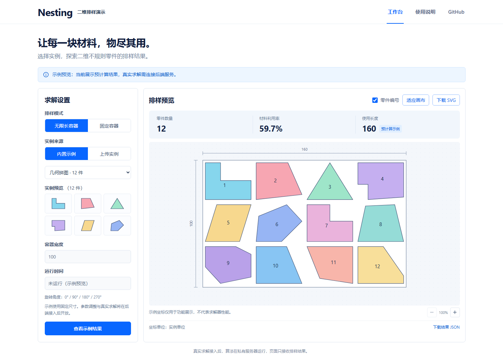

# Nesting · 二维排样演示

一个独立的公开演示前端，支持两种容器模式、示例排样可视化、TXT 零件预览和结果下载。求解器源代码、可执行程序和后端均不在本仓库。

演示网址（首次启用 Pages 后生效）：**https://iliujin.github.io/nesting-demo/**

## 当前能做什么

- 查看无限长容器与固定容器的合成示例，切换容器、缩放、选择零件、显示编号。
- 显示从坐标计算的零件数量、材料利用率、使用长度或容器数量。
- 下载带有“预计算示例”说明的 SVG，以及包含完整坐标的 JSON。
- 上传坐标行格式 TXT，在浏览器中预览自己的零件；可下载格式模板。
- 使用桌面、手机或键盘访问工作台。

**本版本没有连接真实求解服务。** 所有内置排样均为专门制作的合成展示数据，不代表算法效果或性能。上传文件只在当前浏览器内存中处理，不会发送到服务器，也不持久保存；刷新页面会清除上传内容。



## 本地运行

使用 Node.js 24 和 npm。依赖版本固定在 `package-lock.json` 中。

```bash
git clone git@github.com:iliujin/nesting-demo.git
cd nesting-demo
npm ci
npm run dev
```

打开终端显示的 `/nesting-demo/` 地址。

```bash
npm test
npm run build
npx playwright install chromium --only-shell
npm run test:e2e
npm run preview
```

`npm run build` 包含 Vue/TypeScript 检查，产物在 `dist/`。TypeScript 固定为 5.9.3，因为当前 Vue 类型检查工具使用的编译器入口不兼容 TypeScript 7；升级时应重新验证。

## 首次启用 GitHub Pages

1. 打开 [仓库 Pages 设置](https://github.com/iliujin/nesting-demo/settings/pages)。
2. 在 **Build and deployment → Source** 选择 **GitHub Actions**。
3. 打开 [Actions](https://github.com/iliujin/nesting-demo/actions)，运行 **Verify and deploy demo → Run workflow → main**；如果已有运行在等待发布，待其结束或重新运行失败的部署。
4. 成功后访问演示网址。后续推送 `main` 会自动检查并发布。

工作流执行单元测试、类型检查、生产构建与桌面/手机交互测试。只上传 `dist/`；PR 运行检查但不部署。首次开通 Pages 需要仓库管理权限，默认工作流令牌不能代替管理员启用该功能。

Vite 的 `base` 已设为 `/nesting-demo/`。更改仓库名称或使用自定义域名时同步修改 `vite.config.ts`。不需要把任何求解器仓库添加为 submodule，也不需要给本仓库配置私有仓库访问令牌。

## 上传格式与边界

UTF-8 `.txt` 示例：

```text
name: rectangle-and-triangle
size: 2
object: width: 100
no. quantity
1 2 x 0 20 20 0
    y 0 0 10 10
2 1 x 0 15 0
    y 0 0 15
```

`size` 是零件类型数；可选数量决定每种零件出现几件。也支持 `no` 标头以及 `1 x ...` 这种默认一件的写法。每个 x 行后紧跟 y 行。支持负坐标、科学计数法、CRLF、空行与 `#` 注释；重复闭合顶点会移除。

上限为 1 MiB、500 件、单件 500 顶点、展开后 10,000 顶点、坐标绝对值 1,000,000。拒绝数量不匹配、自交、退化及非有限坐标。当前不支持 PIECE 分块、孔洞、DXF 或任意文件格式；缩略图独立缩放。

浏览器检查只服务于预览，不能替代后端的几何和资源校验。

## 接入私有后端

见 [后端接入边界](docs/backend-contract.md)。`public/config.json` 预留了公开的 HTTPS 接口地址字段；**此版本不会读取它来开启求解**，仅修改配置不会产生在线计算能力。真实接口确认后，应实现独立适配器并验证上传、排队、查询、取消、下载完整流程。

页面代码与接口地址可以被浏览器用户查看。密码、数据库连接、共享 API 密钥和求解器程序都必须留在后端。

## 技术与验证

Vue 3 + TypeScript + Vite；Vitest 测试几何与文件处理，Playwright 测试用户流程。详情见 [验证记录](docs/verification.md)。
